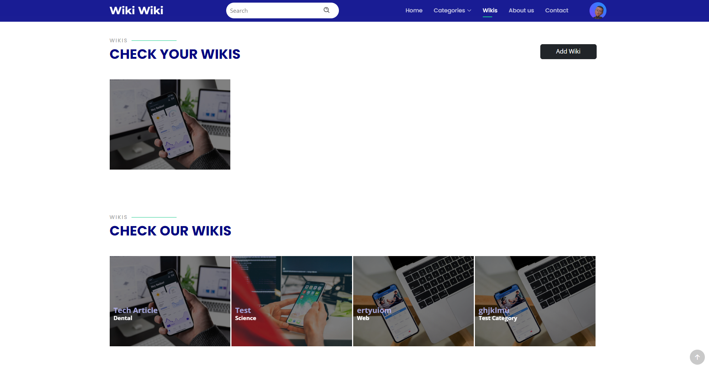

# [Wiki Wiki]

[Your Project Description]

## Project Overview

Wiki is a content management system designed to provide an efficient backend for managing categories, tags, and wikis. The frontend focuses on delivering an exceptional user experience with features like simplified registration, an effective search bar, and dynamic displays of the latest wikis and categories for seamless navigation.

## Key Features

### Back Office

#### Category Management (Admin)

- Create, edit, and delete categories to organize content.
- Associate multiple wikis with a category.

#### Tag Management (Admin)

- Create, edit, and delete tags for content search and grouping.
- Associate tags with wikis for precise navigation.

#### Author Registration

- Authors can register on the platform by providing basic information.
- Manage wikis (create, edit, delete).

### Front Office

#### Login and Register

- Users can create an account and log in.
- Administrators are redirected to the dashboard; others to the homepage.

#### Search Bar (AJAX-enabled)

- Enables users to search wikis, categories, and tags without page reload.

#### Latest Wikis Display

- Homepage or a dedicated section displays the latest added wikis.

#### Latest Categories Display

- A separate section showcases the latest created or updated categories.

#### Wiki Details Page

- Clicking on a wiki redirects users to a dedicated page with comprehensive details.

## Technologies Used

### Frontend

- HTML5
- CSS Framework Bootstrap Framework
- JavaScript / AJAX

### Backend

- PHP 8 with MVC architecture

### Database

- PDO driver

## Dashboard

- View statistics of entities through the dashboard.

## Getting Started

1. Clone the repository.
2. Set up the database using [script.sql](script.sql).
3. Configure your environment variables.
4. Run the application.

## Contributing

Contributions are welcome! Please follow our [contribution guidelines](CONTRIBUTING.md).

## License

This project is licensed under the [MIT License](LICENSE).

## Screenshots

